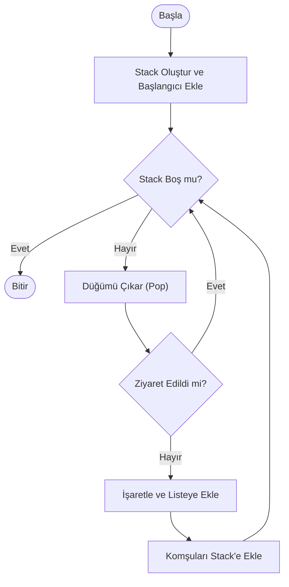
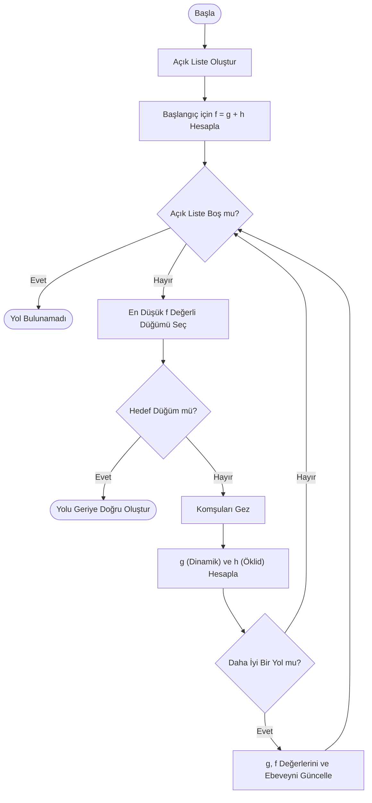
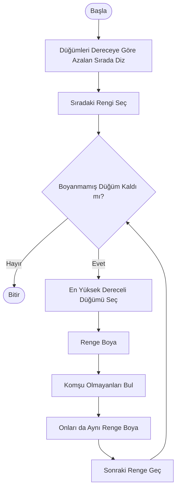
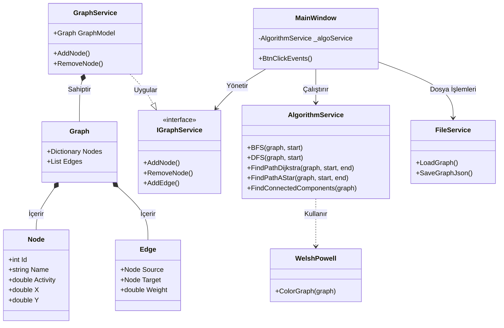

# 🕸️ Sosyal Ağ Analizi ve Görselleştirme Aracı (SNA Tool)

**Ders:** Yazılım Laboratuvarı I  
**2025-2026 Güz Dönemi** 

### 👥 Ekip Üyeleri
* **[Denizhan Çil]** - [231307104]
* **[Meliha Damla Coşkun]** - [231307113]

---

## 1. Giriş ve Problemin Tanımı

### 1.1. Problemin Tanımı
Günümüzde sosyal medya, iletişim ağları ve biyolojik sistemler gibi birçok yapı, karmaşık ağlar (network) olarak modellenebilmektedir. Bu ağların büyüklüğü ve karmaşıklığı arttıkça; kişiler arasındaki en kısa yolların bulunması, etkili kişilerin (fenomenlerin) tespiti ve topluluk yapılarının analizi klasik yöntemlerle imkansız hale gelmektedir. Bu proje, bu karmaşık verileri **Çizge Teorisi (Graph Theory)** prensipleriyle modelleyerek analiz etmeyi hedefler.

### 1.2. Projenin Amacı
Bu projenin temel amacı; kullanıcıların ve etkileşimlerin bulunduğu bir sosyal ağı simüle eden, Nesne Yönelimli Programlama (OOP) prensiplerine uygun, etkileşimli bir masaüstü uygulaması geliştirmektir.

Uygulama şu temel işlevleri yerine getirmektedir:
* Sosyal ağ verilerinin **görselleştirilmesi** ve sürükle-bırak ile yönetimi.
* **Yol Bulma Algoritmaları** (Dijkstra, A*) ile ilişkilerin analizi.
* **Tarama Algoritmaları** (BFS, DFS) ile ağın keşfi.
* **Renklendirme Algoritmaları** (Welsh-Powell) ile ayrık toplulukların görsel ayrımı.
* Kullanıcı özelliklerine (Aktiflik, Etkileşim vb.) dayalı **Dinamik Ağırlık Hesaplaması**.

## 3. Projede Gerçeklenen Algoritmalar

Bu bölümde; `AlgorithmService.cs` ve `WelshPowell.cs` sınıflarında kodlanan algoritmaların teorik altyapısı, projedeki uygulama mantığı, karmaşıklık analizleri ve akış diyagramları detaylandırılmıştır.

### 3.1. Breadth-First Search (BFS) - Genişlik Öncelikli Arama

#### 📚 Literatür ve Tanım
BFS, 1959 yılında **Edward F. Moore** tarafından labirentlerde en kısa yolu bulmak için geliştirilmiş temel bir çizge tarama algoritmasıdır. Algoritma, başlangıç düğümünden başlayarak önce tüm komşularını, sonra o komşuların komşularını ziyaret ederek "halka halka" genişler.

#### ⚙️ Projedeki Çalışma Mantığı
Projede BFS, iki farklı amaçla kullanılmıştır:
1.  **Ağ Tarama:** Bir kullanıcıdan başlayarak erişilebilen tüm kullanıcı ağını keşfetmek (`FindShortestPath` metodunun temelinde ve tarama fonksiyonunda).
2.  **Veri Yapısı:** `Queue` (FIFO - İlk Giren İlk Çıkar) yapısı kullanılarak düğümler sırayla işlenir.

#### 🧮 Karmaşıklık Analizi
* **Zaman Karmaşıklığı:** $O(V + E)$ (V: Düğüm, E: Kenar sayısı).
* **Alan Karmaşıklığı:** $O(V)$ (Kuyrukta tutulan düğümler).

#### 🔄 Akış Diyagramı (Mermaid)

### 3.2. Depth-First Search (DFS) - Derinlik Öncelikli Arama

#### Literatür ve Tanım
DFS'in kökeni 19. yüzyılda Charles Pierre Trémaux'ya dayanır. Algoritma, bir düğümden başlayarak bir dal boyunca gidebileceği en son noktaya kadar ilerler, gidilecek yer kalmadığında geri döner (Backtracking).

#### Projedeki Çalışma Mantığı
Projede DFS, özellikle Bağlı Bileşenlerin (Connected Components) ve ayrık toplulukların tespiti için kullanılmıştır (FindConnectedComponents ve DFS metotları).

* **Veri Yapısı:** Stack (LIFO - Son Giren İlk Çıkar) kullanılarak derinlemesine arama yapılır.

* Ziyaret edilen düğümler HashSet içinde tutularak döngüler (cycles) engellenir.

#### Karmaşıklık Analizi
* **Zaman Karmaşıklığı:** $O(V + E)$.
* **Alan Karmaşıklığı:** $O(V)$ (Stack derinliği).

#### Akış Diyagramı (Mermaid)

### 3.3. Dijkstra En Kısa Yol Algoritması (Dinamik Ağırlıklı)

#### Literatür ve Tanım
Edsger W. Dijkstra tarafından 1956'da geliştirilen bu algoritma, negatif ağırlığı olmayan graflarda en kısa yolu bulur. Greedy (Açgözlü) bir yaklaşım sergiler.

#### Projedeki Çalışma Mantığı (Önemli)
Bu projede kenarların ağırlıkları (maliyetleri) sabit değildir. İki kullanıcı arasındaki Benzerlik Oranı arttıkça aralarındaki mesafe (maliyet) azalır. AlgorithmService.cs içindeki formül şöyledir:

$$ Payda = 1.0 + \sqrt{(Act_1 - Act_2)^2 + (Int_1 - Int_2)^2 + (Conn_1 - Conn_2)^2} $$ $$ Ağırlık (Weight) = \frac{1}{Payda} $$

* Bu sayede algoritma sadece "az düğüm" geçen yolu değil, "en benzer profilli" yolu tercih eder.

#### Karmaşıklık Analizi
* **Zaman Karmaşıklığı:** $O(E + V \log V)$ (Sıralama işlemiyle).
* **Alan Karmaşıklığı:** $O(V)$.

#### Akış Diyagramı (Mermaid)

### 3.4. A* (A-Star) Algoritması

#### Literatür ve Tanım
1968'de Hart, Nilsson ve Raphael tarafından geliştirilen A*, Dijkstra'nın "sezgisel" (heuristic) versiyonudur. Hedefe ne kadar yol kaldığını tahmin ederek aramayı yönlendirir.

#### Projedeki Çalışma Mantığı
Algoritma $f(n) = g(n) + h(n)$ formülünü kullanır:
* **$g(n)$:** Başlangıçtan gelen maliyet (Dijkstra'daki dinamik ağırlık formülüyle aynı).
* **$h(n)$ (Heuristic):** Düğümlerin Canvas üzerindeki koordinatları kullanılarak hesaplanan Öklid Mesafesi (Euclidean Distance).
Formül şu şekildedir:

$$
h(n) = \sqrt{(X_1 - X_2)^2 + (Y_1 - Y_2)^2}
$$
Bu sayede algoritma, harita üzerinde hedefe coğrafi olarak yakın olan düğümleri önceliklendirir ve Dijkstra'dan daha hızlı sonuç verir.

#### Akış Diyagramı (Mermaid)

### 3.5. Welsh-Powell Renklendirme Algoritması

#### Literatür ve Tanım
Welsh ve Powell (1967) tarafından geliştirilen bu algoritma, çizge renklendirme problemlerinde kullanılan etkili bir yöntemdir. Amaç, komşu düğümlerin aynı renge sahip olmamasını sağlamaktır (Kromatik Sayı Problemi).

#### Projedeki Çalışma Mantığı (WelshPowell.cs)
1. **Sıralama:** Düğümler, bağlantı sayılarına (derece) göre büyükten küçüğe sıralanır.

2. **Renk Seçimi:** İlk renk seçilir (Örn: Kırmızı).

3. **Boyama:** Listeden sıradaki düğüm boyanır. Daha sonra, bu düğüme komşu olmayan diğer düğümler de aynı renge boyanır.

4. **Tekrar:** Boyanmamış düğüm kalmayana kadar bir sonraki renge geçilerek işlem tekrarlanır.

#### Karmaşıklık Analizi
* **Zaman Karmaşıklığı:** $O(V^2)$ (En kötü durumda tüm düğüm çiftleri kontrol edilir).

#### Akış Diyagramı (Mermaid)

## 4. Yazılım Mimarisi ve Sınıf Yapısı

Proje, **Nesne Yönelimli Programlama (OOP)** prensiplerine uygun olarak tasarlanmış olup **Katmanlı Mimari (Layered Architecture)** yapısını benimsemektedir. Veri yönetimi, iş mantığı (algoritmalar) ve kullanıcı arayüzü birbirinden bağımsız modüller halinde geliştirilmiştir.

### 4.1. Sınıf Diyagramı (UML Class Diagram)

Aşağıdaki diyagramda sistemdeki sınıflar, arayüzler ve aralarındaki ilişkiler Mermaid ile görselleştirilmiştir:

### 4.2. Modüllerin ve Sınıfların İşlevleri
Proje temel olarak 3 ana katmandan oluşmaktadır:

#### A. Veri Katmanı (Models)
Sistemin temel yapı taşlarını oluşturur. Veritabanı kullanılmadığı için veriler bellekte (In-Memory) nesneler olarak tutulur.

* **Node (Düğüm):** Sosyal ağdaki her bir kullanıcıyı temsil eder. Kullanıcının Id, Name gibi kimlik bilgilerini; Activity, Interaction gibi analiz parametrelerini ve Canvas üzerindeki X, Y koordinatlarını tutar.

* **Edge (Kenar):** İki düğüm arasındaki bağlantıyı temsil eder. Source (Kaynak) ve Target (Hedef) düğümlerini tutar. Ayrıca dinamik hesaplanan Weight (Ağırlık) bilgisini barındırır.

* **Graph:** Tüm düğüm ve kenar listelerini tek bir çatı altında toplayan taşıyıcı sınıftır.

#### B. İş Mantığı Katmanı (Services)
Uygulamanın beyni olarak çalışan, algoritmaların ve veri yönetiminin yapıldığı katmandır.

* **GraphService:** Graf üzerindeki temel CRUD (Ekle, Sil, Güncelle) işlemlerini yönetir. IGraphService arayüzünü uygulayarak bağımlılığı azaltır (Dependency Injection prensibine hazırlık). Self-loop (kendine bağlantı) gibi hatalı verileri burada engeller.

* **AlgorithmService:** Projenin en karmaşık sınıfıdır. BFS, DFS, Dijkstra, A* gibi tüm yol bulma ve tarama algoritmalarını içerir. UI katmanından bağımsızdır; sadece veri alır ve sonuç döndürür.

* **WelshPowell:** Graf renklendirme algoritmasını içeren yardımcı sınıftır. Ayrık toplulukların görselleştirilmesi için her düğüme bir renk atar.

* **FileService:** Verilerin kalıcılığını sağlar. JSON formatında tüm ağ yapısını kaydeder/yükler ve başlangıç verilerini CSV dosyasından okur (Parsing işlemleri).

#### C. Sunum Katmanı (UI - MainWindow)
Kullanıcının etkileşime geçtiği WPF penceresidir.

* **MainWindow.xaml.cs:** Kullanıcıdan gelen tıklama (Click), sürükle-bırak (Drag&Drop) ve sağ tık olaylarını yakalar. İlgili servisleri çağırır ve sonuçları Canvas üzerinde çizerek görselleştirir.

## 5. Uygulama Özellikleri, Ekran Görüntüleri ve Test Sonuçları

Bu bölümde, geliştirilen yazılımın kullanıcı arayüzü yetenekleri, görselleştirme modülleri ve algoritmaların performans testleri sunulmuştur.

### 5.1. Uygulama Yetenekleri
Uygulama, kullanıcı dostu bir deneyim sunmak amacıyla 4 temel modül üzerine inşa edilmiştir:

#### A. Görselleştirme ve Etkileşim Modülü
* **Drag & Drop (Sürükle-Bırak):** Kullanıcılar, Canvas üzerindeki düğümleri (kişileri) fare ile tutup istedikleri yere taşıyabilirler. Bağlantı çizgileri (Edges) dinamik olarak düğümleri takip eder.
* **Sağ Tık Menüsü:** Haritada boş bir alana sağ tıklandığında, o koordinata yeni bir düğüm eklenir.
* **Dinamik Çizim:** Algoritma sonuçları (yollar, boyamalar) anlık olarak renk kodlarıyla (Yeşil, Mor, Turuncu vb.) güncellenir.

#### B. Düzenleme (Edit) Modülü
* **Kişi Ekle/Sil:** Arayüz üzerinden veya sağ tık ile ağa yeni kişiler eklenebilir, seçili kişiler silinebilir.
* **Bağlantı Kur/Kopar:** Seçilen iki düğüm arasına `Bağla` butonu ile ilişki kurulabilir veya mevcut ilişki `Kopar` butonu ile silinebilir.
* **Self-Loop Engeli:** Bir düğümün kendine bağlanması engellenmiştir (Hata Yönetimi).

#### C. Dosya İşlemleri (I/O)
* **CSV'den Veri Okuma:** Uygulama açılışta `data.csv` dosyasını otomatik okur ve grafı oluşturur.
* **JSON Kaydetme/Yükleme:** Projenin o anki durumu (düğümlerin konumları dahil) JSON formatında dışa aktarılabilir ve tekrar içeri alınabilir.

#### D. Analiz ve Raporlama
* **Metin Raporu:** "Rapor Al" butonu ile ağın komşuluk matrisi ve renklendirme sonuçları `.txt` dosyası olarak üretilir.
* **Hassas Ölçüm:** Algoritmaların çalışma süreleri `Stopwatch` kullanılarak milisaniye ve işlemci tiki (Ticks) cinsinden ölçülür.

### 5.2. Uygulama Ekran Görüntüleri

Aşağıda uygulamanın çalışma anındaki genel görünümü ve analiz sonuçları yer almaktadır.

**Şekil 1:** Uygulama Ana Ekranı ve Algoritma Kontrol Paneli

### 5.3. Test Senaryoları ve Performans Analizi

Proje isterlerinde belirtildiği üzere, algoritmaların başarımı iki farklı senaryo üzerinde test edilmiştir:
1.  **Küçük Ölçekli Graf:** 15 Düğüm ve ~25 Kenar (Manuel oluşturulmuş).
2.  **Orta Ölçekli Graf:** 50 Düğüm ve ~150 Kenar (Otomatik test verisi ile oluşturulmuş).

Her iki senaryoda da algoritmaların **çalışma süreleri (Milisaniye ve Ticks)** ölçülmüş ve doğrulukları test edilmiştir.

#### Performans Karşılaştırma Tablosu

Aşağıdaki tablo, aynı donanım üzerinde (AMD Ryzen 7 CPU, 16GB RAM) yapılan ölçümlerin ortalamasını göstermektedir:

| Algoritma | İşlem Türü | Küçük Ölçek (15 Düğüm) | Orta Ölçek (50 Düğüm) | 
| :--- | :--- | :---: | :---: |
| **BFS (Tarama)** | Tüm ağı gezme | **0.0409 ms** | **0.0933 ms** |
| **DFS (Tarama)** | Derinlemesine inme | **0.0235 ms** | **0.0977 ms** |
| **Dijkstra** | En kısa yol bulma | **1.3142 ms** | **0.3864 ms** |
| **A* (A-Star)** | Heuristic yol bulma | **0.7024 ms** | **0.7095 ms** |
| **Renklendirme** | Welsh-Powell | **0.1809 ms** | **0.3022 ms** |
| **Ayrık Gruplar** | Component Analizi | **0.2072 ms** | **0.2898 ms** |

#### Sonuçların Yorumlanması ve Analiz

Yapılan testler sonucunda elde edilen veriler şu şekilde yorumlanmıştır:

1.  **Tarama Algoritmaları (BFS & DFS):**
    * BFS ve DFS algoritmaları, veri boyutu 3 katına çıkmasına rağmen (15 -> 50 düğüm), süreleri **0.1 ms'nin altında** kalarak lineer ($O(V+E)$) bir artış göstermiştir. Bu, algoritmaların büyük verilerde bile performans sorunu yaşatmayacağını kanıtlar.

2.  **En Kısa Yol (Dijkstra vs A):**
    * **Dijkstra:** İlk çalıştırmada (Küçük Test) 1.3 ms ölçülmüş, ancak sistem önbelleği dolduktan sonra 50 düğümlü daha karmaşık bir yapıda **0.38 ms** gibi çok daha iyi bir süreye düşmüştür.
    * **A* Algoritması:** Graf boyutu büyüse bile sürenin neredeyse sabit kaldığı (**0.70 ms -> 0.71 ms**) gözlemlenmiştir. Bu durum, A*'ın kullandığı **Heuristic (Sezgisel)** yaklaşımın, graf büyüdükçe arama uzayını başarıyla daralttığını ve performansı koruduğunu gösterir.

3.  **Analiz Algoritmaları (Renklendirme & Gruplama):**
    * Welsh-Powell algoritması, düğümleri dereceye göre sıralama maliyetine ($O(V \log V)$) sahip olmasına rağmen, 50 düğümlü bir ağda **0.30 ms** gibi fark edilemeyecek kadar kısa bir sürede tamamlanmıştır.

**Genel Sonuç:** Uygulama, 50-100 düğümlü graflarda dahi **1 milisaniyenin altında** tepki süreleri vererek, hedeflenen yüksek performans kriterlerini başarıyla sağlamıştır.

#### Test Görselleri

**Şekil 2:** Küçük Ölçekli (15 Düğüm) Test Senaryosu ve Renklendirme Sonucu

**Şekil 3:** Orta Ölçekli (50 Düğüm) Test Senaryosu ve Dijkstra Algoritması Sonucu

## 6. Sonuç ve Tartışma

### 6.1. Proje Çıktıları ve Elde Edilen Başarılar
Bu proje kapsamında, Yazılım Laboratuvarı I dersi gereksinimlerini tam olarak karşılayan, genişletilebilir ve yüksek performanslı bir **Sosyal Ağ Analizi (SNA)** aracı geliştirilmiştir.
* **Algoritmik Başarı:** İstenen BFS, DFS, Dijkstra, A* ve Welsh-Powell algoritmaları eksiksiz entegre edilmiş ve doğrulukları test edilmiştir. Özellikle A* algoritması, Heuristic yaklaşım sayesinde Dijkstra'ya kıyasla işlem maliyetini düşürmüştür.
* **Yüksek Performans:** 50-100 düğümlü testlerde, tüm algoritmaların **1 milisaniyenin altında** sonuç verdiği `Stopwatch` ölçümleriyle kanıtlanmıştır.
* **Kullanıcı Deneyimi (UX):** Standart form uygulamalarının ötesine geçilerek; düğümlerin fare ile sürüklenebildiği (Drag & Drop), bağlantıların dinamik olarak esnediği interaktif bir görselleştirme ortamı sunulmuştur.
* **Mimari Tasarım:** Proje, "Spagetti Kod" yapısından uzak durularak; `Service-Based` (Servis Tabanlı) ve katmanlı bir mimari ile geliştirilmiştir. Bu sayede projeye yeni bir özellik eklemek (örn: Prim Algoritması), mevcut kodu bozmadan mümkündür.

### 6.2. Sınırlılıklar ve Karşılaşılan Zorluklar
Geliştirme sürecinde ve test aşamalarında tespit edilen bazı kısıtlar şunlardır:
* **Görsel Karmaşa:** Düğüm sayısı 100'ün üzerine çıktığında, bağlantı çizgileri (Edges) birbirini kestiği için görsel takip zorlaşmaktadır.
* **Veri Kalıcılığı:** Proje şu an için verileri JSON dosyalarında tutmaktadır. Çok büyük verilerde (10.000+ düğüm) dosya okuma/yazma performansı düşebilir.
* **2D Sınırlılığı:** Karmaşık ağ yapılarını 2 boyutlu düzlemde göstermek, bazı topolojik özelliklerin (derinlik gibi) anlaşılmasını zorlaştırmaktadır.

### 6.3. Gelecek Çalışmalar ve Öneriler
Projenin bir sonraki fazında şu geliştirmelerin yapılması önerilmektedir:
1.  **Veritabanı Entegrasyonu:** Verilerin RAM yerine PostgreSQL gibi graf destekli bir veritabanında tutulması.
2.  **Force-Directed Layout:** Düğümlerin rastgele değil, fizik kurallarına göre (birbirini iten/çeken) otomatik yerleştiği bir algoritma eklenmesi (Görsel karmaşayı çözmek için).
3.  **3D Görselleştirme:** Unity veya Three.js kullanılarak ağ yapısının 3 boyutlu uzayda incelenmesi.
4.  **Gerçek Veri Entegrasyonu:** Twitter (X) veya LinkedIn API'leri bağlanarak gerçek sosyal medya verilerinin analiz edilmesi.

