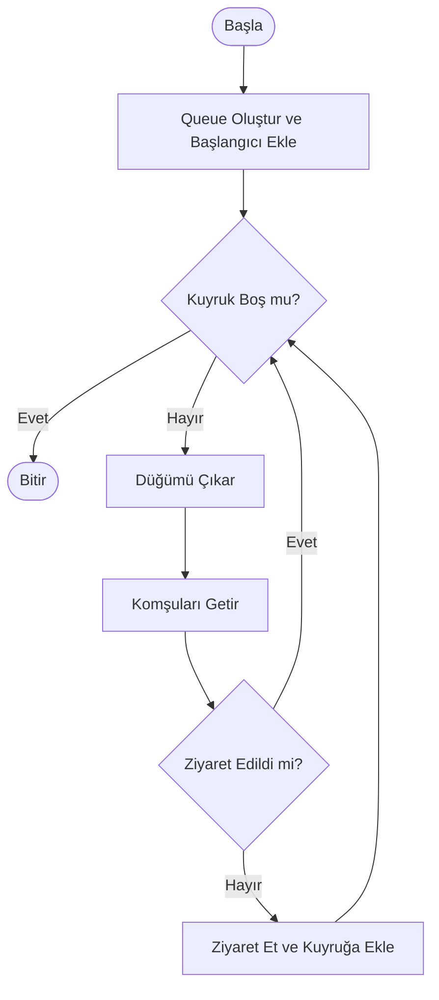
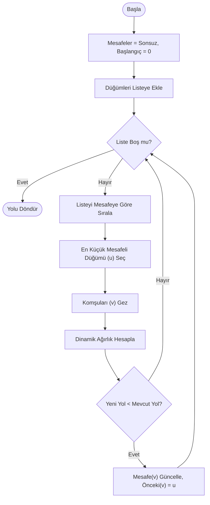

# 🕸️ Sosyal Ağ Analizi ve Görselleştirme Aracı (SNA Tool)

**Ders:** Yazılım Laboratuvarı I  
**2025-2026 Güz Dönemi** 

### 👥 Ekip Üyeleri
* **[Denizhan Çil]** - [231307104]
* **[Meliha Damla Coşkun]** - [231307113]

---

## 1. Giriş ve Problemin Tanımı

### 1.1. Problemin Tanımı
Günümüzde sosyal medya, iletişim ağları ve biyolojik sistemler gibi birçok yapı, karmaşık ağlar (network) olarak modellenebilmektedir. Bu ağların büyüklüğü ve karmaşıklığı arttıkça; kişiler arasındaki en kısa yolların bulunması, etkili kişilerin (fenomenlerin) tespiti ve topluluk yapılarının analizi klasik yöntemlerle imkansız hale gelmektedir. Bu proje, bu karmaşık verileri **Çizge Teorisi (Graph Theory)** prensipleriyle modelleyerek analiz etmeyi hedefler.

### 1.2. Projenin Amacı
Bu projenin temel amacı; kullanıcıların ve etkileşimlerin bulunduğu bir sosyal ağı simüle eden, Nesne Yönelimli Programlama (OOP) prensiplerine uygun, etkileşimli bir masaüstü uygulaması geliştirmektir.

Uygulama şu temel işlevleri yerine getirmektedir:
* Sosyal ağ verilerinin **görselleştirilmesi** ve sürükle-bırak ile yönetimi.
* **Yol Bulma Algoritmaları** (Dijkstra, A*) ile ilişkilerin analizi.
* **Tarama Algoritmaları** (BFS, DFS) ile ağın keşfi.
* **Renklendirme Algoritmaları** (Welsh-Powell) ile ayrık toplulukların görsel ayrımı.
* Kullanıcı özelliklerine (Aktiflik, Etkileşim vb.) dayalı **Dinamik Ağırlık Hesaplaması**.

## 3. Projede Gerçeklenen Algoritmalar

Bu bölümde; `AlgorithmService.cs` ve `WelshPowell.cs` sınıflarında kodlanan algoritmaların teorik altyapısı, projedeki uygulama mantığı, karmaşıklık analizleri ve akış diyagramları detaylandırılmıştır.

### 3.1. Breadth-First Search (BFS) - Genişlik Öncelikli Arama

#### 📚 Literatür ve Tanım
BFS, 1959 yılında **Edward F. Moore** tarafından labirentlerde en kısa yolu bulmak için geliştirilmiş temel bir çizge tarama algoritmasıdır. Algoritma, başlangıç düğümünden başlayarak önce tüm komşularını, sonra o komşuların komşularını ziyaret ederek "halka halka" genişler.

#### ⚙️ Projedeki Çalışma Mantığı
Projede BFS, iki farklı amaçla kullanılmıştır:
1.  **Ağ Tarama:** Bir kullanıcıdan başlayarak erişilebilen tüm kullanıcı ağını keşfetmek (`FindShortestPath` metodunun temelinde ve tarama fonksiyonunda).
2.  **Veri Yapısı:** `Queue` (FIFO - İlk Giren İlk Çıkar) yapısı kullanılarak düğümler sırayla işlenir.

#### 🧮 Karmaşıklık Analizi
* **Zaman Karmaşıklığı:** $O(V + E)$ (V: Düğüm, E: Kenar sayısı).
* **Alan Karmaşıklığı:** $O(V)$ (Kuyrukta tutulan düğümler).

#### 🔄 Akış Diyagramı (Mermaid)

### 3.2. Depth-First Search (DFS) - Derinlik Öncelikli Arama

#### Literatür ve Tanım
DFS'in kökeni 19. yüzyılda Charles Pierre Trémaux'ya dayanır. Algoritma, bir düğümden başlayarak bir dal boyunca gidebileceği en son noktaya kadar ilerler, gidilecek yer kalmadığında geri döner (Backtracking).

#### Projedeki Çalışma Mantığı
Projede DFS, özellikle Bağlı Bileşenlerin (Connected Components) ve ayrık toplulukların tespiti için kullanılmıştır (FindConnectedComponents ve DFS metotları).

* **Veri Yapısı:** Stack (LIFO - Son Giren İlk Çıkar) kullanılarak derinlemesine arama yapılır.

* Ziyaret edilen düğümler HashSet içinde tutularak döngüler (cycles) engellenir.

#### Karmaşıklık Analizi
* **Zaman Karmaşıklığı:** $O(V + E)$.
* **Alan Karmaşıklığı:** $O(V)$ (Stack derinliği).

#### Akış Diyagramı (Mermaid)

### 3.3. Dijkstra En Kısa Yol Algoritması (Dinamik Ağırlıklı)

#### Literatür ve Tanım
Edsger W. Dijkstra tarafından 1956'da geliştirilen bu algoritma, negatif ağırlığı olmayan graflarda en kısa yolu bulur. Greedy (Açgözlü) bir yaklaşım sergiler.

#### Projedeki Çalışma Mantığı (Önemli)
Bu projede kenarların ağırlıkları (maliyetleri) sabit değildir. İki kullanıcı arasındaki Benzerlik Oranı arttıkça aralarındaki mesafe (maliyet) azalır. AlgorithmService.cs içindeki formül şöyledir:

$$ Payda = 1.0 + \sqrt{(Act_1 - Act_2)^2 + (Int_1 - Int_2)^2 + (Conn_1 - Conn_2)^2} $$ $$ Ağırlık (Weight) = \frac{1}{Payda} $$

* Bu sayede algoritma sadece "az düğüm" geçen yolu değil, "en benzer profilli" yolu tercih eder.

#### Karmaşıklık Analizi
* **Zaman Karmaşıklığı:** $O(E + V \log V)$ (Sıralama işlemiyle).
* **Alan Karmaşıklığı:** $O(V)$.

#### Akış Diyagramı (Mermaid)

### 3.4. A* (A-Star) Algoritması

#### Literatür ve Tanım
1968'de Hart, Nilsson ve Raphael tarafından geliştirilen A*, Dijkstra'nın "sezgisel" (heuristic) versiyonudur. Hedefe ne kadar yol kaldığını tahmin ederek aramayı yönlendirir.

#### Projedeki Çalışma Mantığı
Algoritma $f(n) = g(n) + h(n)$ formülünü kullanır:
* **$g(n)$:** Başlangıçtan gelen maliyet (Dijkstra'daki dinamik ağırlık formülüyle aynı).
* **$h(n)$ (Heuristic):** Düğümlerin Canvas üzerindeki koordinatları kullanılarak hesaplanan Öklid Mesafesi (Euclidean Distance).
Formül şu şekildedir:

$$
h(n) = \sqrt{(X_1 - X_2)^2 + (Y_1 - Y_2)^2}
$$
Bu sayede algoritma, harita üzerinde hedefe coğrafi olarak yakın olan düğümleri önceliklendirir ve Dijkstra'dan daha hızlı sonuç verir.

#### Akış Diyagramı (Mermaid)

### 3.5. Welsh-Powell Renklendirme Algoritması

#### Literatür ve Tanım
Welsh ve Powell (1967) tarafından geliştirilen bu algoritma, çizge renklendirme problemlerinde kullanılan etkili bir yöntemdir. Amaç, komşu düğümlerin aynı renge sahip olmamasını sağlamaktır (Kromatik Sayı Problemi).

#### Projedeki Çalışma Mantığı (WelshPowell.cs)
1. **Sıralama:** Düğümler, bağlantı sayılarına (derece) göre büyükten küçüğe sıralanır.

2. **Renk Seçimi:** İlk renk seçilir (Örn: Kırmızı).

3. **Boyama:** Listeden sıradaki düğüm boyanır. Daha sonra, bu düğüme komşu olmayan diğer düğümler de aynı renge boyanır.

4. **Tekrar:** Boyanmamış düğüm kalmayana kadar bir sonraki renge geçilerek işlem tekrarlanır.

#### Karmaşıklık Analizi
* **Zaman Karmaşıklığı:** $O(V^2)$ (En kötü durumda tüm düğüm çiftleri kontrol edilir).

#### Akış Diyagramı (Mermaid)

